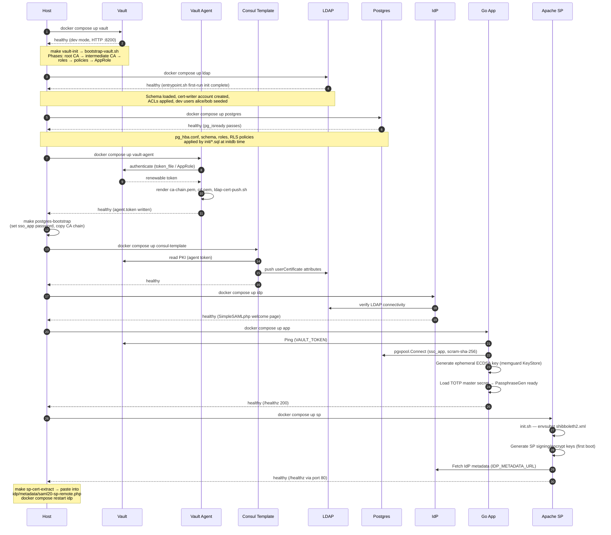
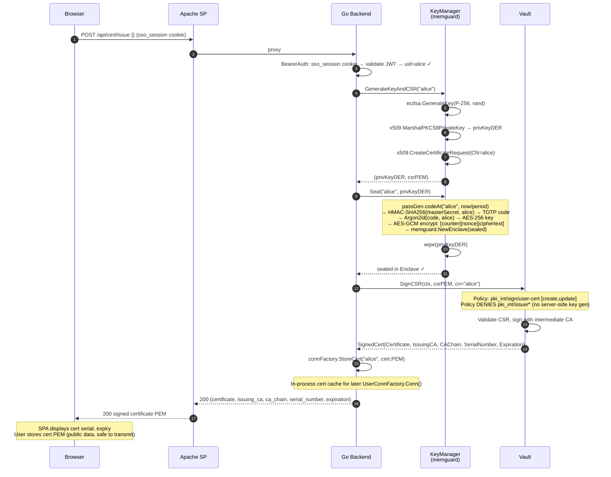
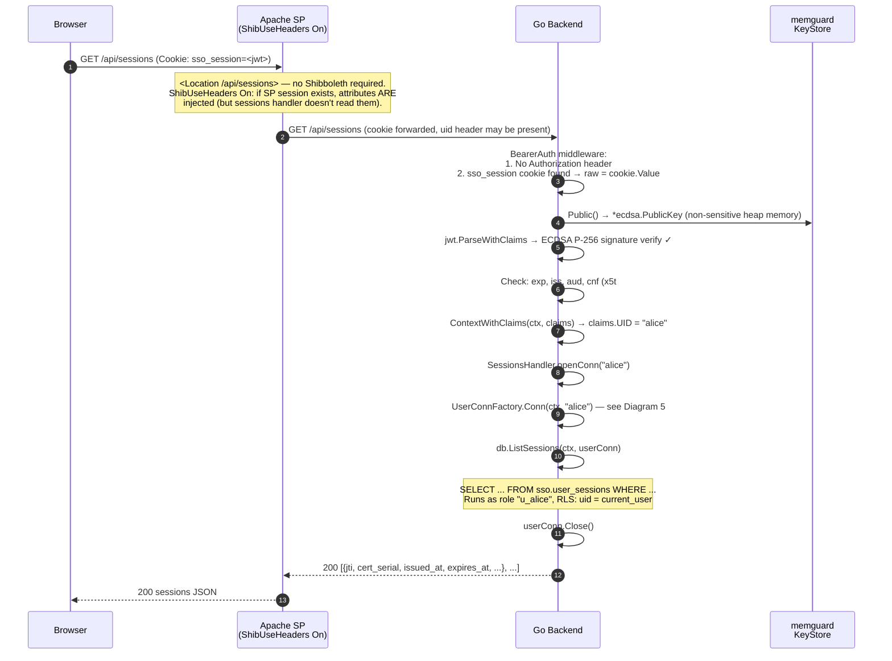
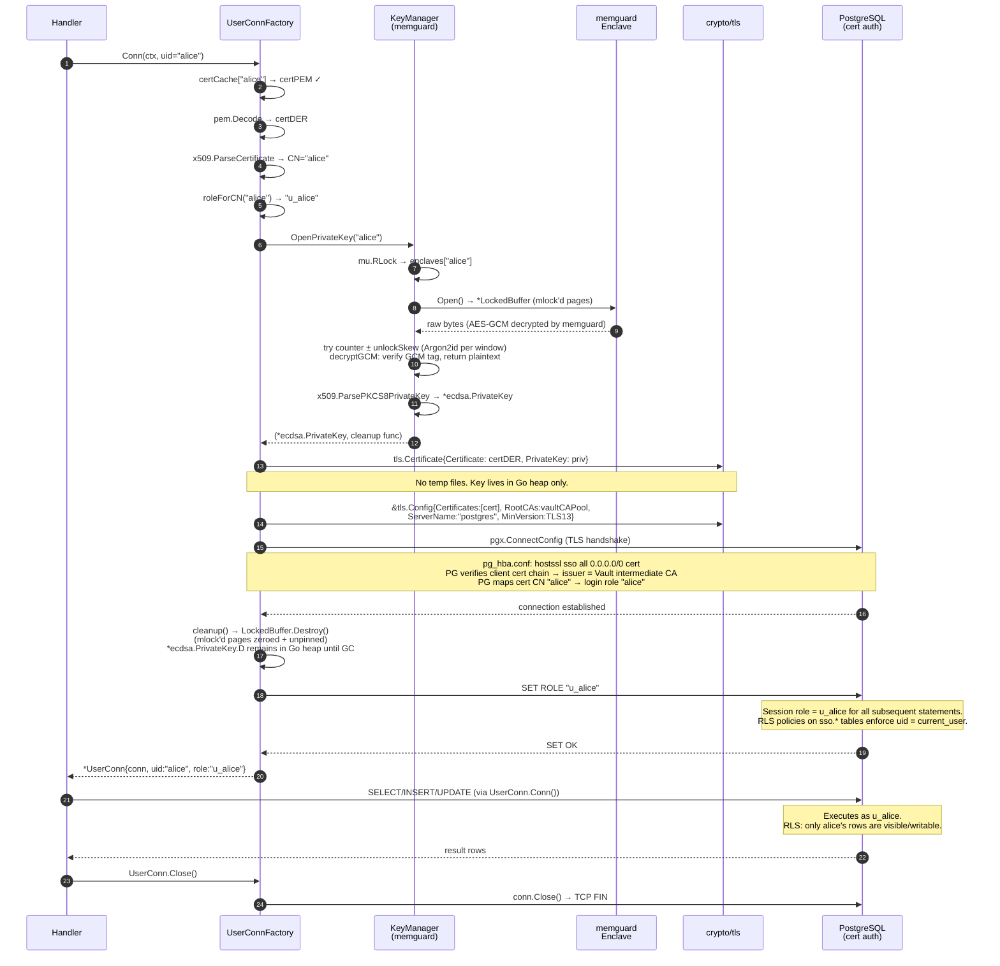

# sso01a — End-to-End Authentication Flow

This document describes the complete flow of the system using Mermaid sequence
diagrams.  Each section covers one phase of the lifecycle.

---

## 1. System Startup & Dependency Order

Services must reach `healthy` before dependents start.  The bootstrap script
(`scripts/bootstrap-all.sh`) enforces this order and runs one-time init steps
between container starts.



---

## 2. Full Login Flow (SAML 2.0 → JWT Cookie)

The SPA is served from the Apache SP at `https://sp.sso.local`.  Shibboleth
is only required on `POST /api/token`; all other paths use JWT auth.

```mermaid
sequenceDiagram
    autonumber
    participant Browser
    participant SP as Apache SP<br/>(Shibboleth)
    participant IdP as SimpleSAMLphp IdP
    participant LDAP
    participant App as Go Backend

    Browser->>SP: GET https://sp.sso.local/ (first visit)
    SP-->>Browser: 200 index.html (from DocumentRoot, no Shibboleth required)
    Note over Browser: SPA loads, FingerprintJS collects visitor ID

    Browser->>SP: GET /api/userinfo (credentials: include)
    SP->>App: proxy (no sso_session cookie yet)
    App-->>SP: 401 Unauthorized
    SP-->>Browser: 401

    Browser->>SP: POST /api/token (uid header absent — no Shibboleth session)
    App-->>SP: 401 (ShibbolethRequired: uid header missing)
    SP-->>Browser: 401

    Note over Browser: SPA shows Login button.<br/>User clicks → redirect to Shibboleth
    Browser->>SP: GET /Shibboleth.sso/Login?target=/
    SP->>Browser: 302 → IdP SSO URL (AuthnRequest in query string)

    Browser->>IdP: GET /simplesaml/saml2/idp/SSOService.php?SAMLRequest=...
    IdP-->>Browser: 200 Login form

    Browser->>IdP: POST credentials (username=alice, password=...)
    IdP->>LDAP: ldap_bind(cn=alice,ou=people,..., password)
    LDAP-->>IdP: bind success
    IdP->>LDAP: ldap_search (uid, mail, ssoCertThumbprint, ssoEnrolledAt)
    LDAP-->>IdP: alice's attributes
    IdP->>IdP: Sign SAML assertion (RSA-3072, SHA-256)
    IdP-->>Browser: 200 Auto-POST form (SAMLResponse → SP ACS URL)

    Browser->>SP: POST /Shibboleth.sso/SAML2/POST (SAMLResponse)
    SP->>SP: mod_shib validates signature, maps attributes
    SP->>SP: Create Shibboleth session, set SP session cookie
    SP-->>Browser: 302 → target (/)

    Browser->>SP: GET / (now has Shibboleth session cookie)
    SP-->>Browser: 200 index.html

    Note over Browser: SPA detects page reload,<br/>retries auth sequence with FingerprintJS visitor ID ready

    Browser->>SP: POST /api/token {fingerprint: "fp-visitor-id"}
    Note over SP: <Location /api/token> requireSession 1<br/>mod_shib injects: uid, mail, ssoCertThumbprint,<br/>ssoDeviceFingerprint, ssoEnrolledAt headers
    SP->>App: POST /api/token (with Shibboleth headers + fingerprint body)
    App->>App: ShibbolethRequired: uid header present ✓
    App->>App: thumbprint present ✓ (or 403 if not enrolled)
    App->>App: Issue JWT: sub=alice, cnf.x5t#S256=thumbprint,<br/>device_fingerprint=fp-visitor-id, iss, aud, exp, jti
    App->>App: Sign JWT (ECDSA P-256, ES256, kid from memguard KeyStore)
    App-->>SP: 200 {token, token_type, expires_in}<br/>Set-Cookie: sso_session=<jwt>; HttpOnly; Secure; SameSite=Strict
    SP-->>Browser: 200 + Set-Cookie (sso_session forwarded from App)

    Note over Browser: JWT cookie set (HttpOnly — JS cannot read it)<br/>SPA retries GET /api/userinfo

    Browser->>SP: GET /api/userinfo (sso_session cookie sent automatically)
    SP->>App: proxy (cookie forwarded)
    App->>App: BearerAuth: no Authorization header → check sso_session cookie ✓
    App->>App: Validate JWT signature, exp, iss, aud, cnf ✓
    App-->>SP: 200 {sub, uid, mail, cert_thumbprint, exp, ...}
    SP-->>Browser: 200 userinfo JSON
    Note over Browser: SPA shows authenticated dashboard
```

---

## 3. x509 Certificate Enrollment

Called by the SPA's Certificate tab after the user is authenticated.  The
private key is generated server-side, sealed in memguard, and never transmitted.



---

## 4. Authenticated API Request (JWT Cookie Path)

Any `/api/*` call after login demonstrates the stateless JWT verification.



---

## 5. Per-User Database Connection (x509 Client Certificate)

Called within each authenticated handler that needs database access.  The
private key exists in plaintext heap memory only for the ~5 ms TLS handshake.



---

## Security Properties Summary

| Layer | Mechanism | What it prevents |
|-------|-----------|-----------------|
| Transport | TLS 1.3 (SP), mTLS 1.3 (PG) | Network eavesdropping, MITM |
| Identity | SAML 2.0 (signed assertions) | Unauthenticated access, assertion forgery |
| Session binding | JWT cnf/x5t#S256 (RFC 7800) | Token theft without the matching cert |
| Device binding | FingerprintJS visitorId in JWT | Token reuse from a different browser profile |
| Key protection | memguard Enclave (mlock, AES-GCM) | Key exposure from process memory dump |
| Key derivation | TOTP passphrase + Argon2id | Offline brute-force of sealed key blobs |
| Secret separation | Docker secrets (TOTP) ∩ memguard (ciphertext) | Single-secret compromise yielding key material |
| DB isolation | SET ROLE + Row-Level Security | Cross-user data access |
| Audit trail | `current_user` in BEFORE INSERT trigger | Application-level audit log forgery |

**Compromise requires all of:** Docker secret (`TOTP_MASTER_SECRET`) **AND** process memory dump (Enclave ciphertext) **AND** TOTP window timing — all simultaneously.
